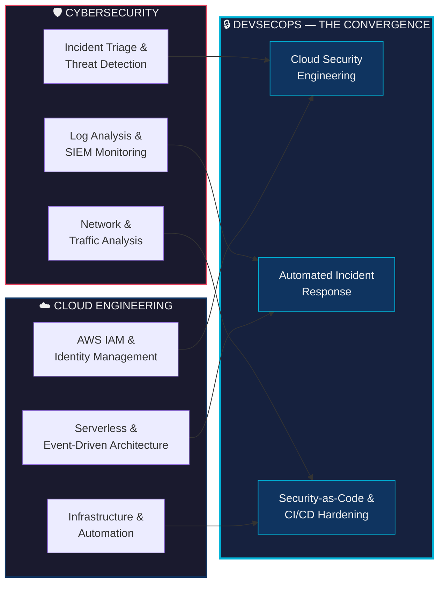

# Rawley Chirume

### SOC Analyst · Cloud Security Engineering · DevSecOps

🎓 B.Sc. Computer Science — Lubelska Akademia WSEI · 📍 Lublin, Poland

---

## 🧭 Professional Summary

Security-focused IT professional with hands-on SOC training and cloud security engineering experience. **Ranked Top 1% on TryHackMe** with practical exposure to log analysis, incident triage, and threat detection workflows. Experienced in monitoring AWS environments, analyzing authentication activity, and implementing **automated containment mechanisms** to mitigate security incidents. Passionate about helping organizations detect, investigate, and respond to security threats in real time.

---

## 🔀 Career Trajectory — Where Cybersecurity Meets Cloud

> *One foot in **Cybersecurity**, the other in **Cloud** — meeting in the middle at **DevSecOps**.*

---

## 🎯 What I Do

| Domain | Focus |
|--------|-------|
| 🔍 **Detect & Respond** | Incident triage, alert escalation, root cause analysis, and real-time threat detection using SIEM platforms |
| 🛡️ **Secure Identities** | AWS IAM policy enforcement, Active Directory administration, least-privilege access, and Kerberos/LDAP analysis |
| ☁️ **Cloud Security Engineering** | Event-driven security pipelines with CloudTrail, Lambda, and SNS for automated containment and alerting |
| 🔗 **Network Analysis** | TCP/IP traffic inspection, DNS investigation, and port-level analysis using Wireshark |
| ⚙️ **Automate & Harden** | Python (Boto3) scripting for security automation, CI/CD pipeline hardening, and infrastructure-as-code |

---

## 🚀 Featured Projects

### **1. [AWS Cloud Detection Lab](https://github.com/rawleyc/aws-cloud-detection-lab)** &nbsp; `May 2026`

**Cloud-native threat detection pipeline — deployed on AWS free tier, detecting real-world attacks.**

- 🔍 **Detection:** Built a Python pipeline ingesting CloudTrail and VPC Flow Logs from S3 via boto3, with 9 MITRE ATT&CK-mapped detection rules across IAM and network layers.
- 🌐 **Real findings:** Detected active internet scanning from 6 external IPs within hours of EC2 deployment — no synthetic traffic required.
- ⚙️ **Engineering:** State-based deduplication, alert grouping to prevent fatigue, and modular rule registry for easy extension.
- 📄 **Output:** Timestamped markdown findings reports with severity triage and MITRE mapping.

---

### **2. [Cloud Security Automation](https://github.com/rawleyc/cloud-security-automation)** &nbsp; `Mar 2026`

**Real-time AWS SOC automation pipeline for unauthorized S3 access detection, containment, and alerting.**

- 🔍 **Detection:** Monitored CloudTrail S3 data events via EventBridge for suspicious bucket/object access.
- ⚡ **Automated Response:** Triggered Lambda to apply a deny-all IAM policy to the offending IAM user.
- 🔔 **SOC Alerting:** Published incident details to SNS for immediate security-team notification.
- 📄 **Audit Visibility:** Preserved event context for investigation and post-incident review.

---

### **3. [Serverless Incident Management System](https://github.com/rawleyc/serverless-incident-manager)** &nbsp; `Jan 2026`

**Serverless security incident ticketing system to improve SOC response coordination.**

- 🏗️ **Architecture:** Designed a cost-efficient, event-driven microservices architecture that scales to zero when idle.
- ⚡ **Backend:** Developed RESTful APIs using **AWS Lambda (Python/Boto3)** and **API Gateway**.
- 🔔 **Event-Driven:** Enabled automated incident creation to streamline SOC team coordination.
- 📉 **Efficiency:** Reduced infrastructure overhead while maintaining scalable incident handling.

---

### **4. [Serverless Task API (Terraform)](https://github.com/rawleyc/stunning-eureka)** &nbsp; `Jul 2026`

**Terraform-based serverless task manager API built to practice cloud architecture fundamentals end to end.**

- 🏗️ **Infrastructure as Code:** Provisioned API Gateway, Lambda, DynamoDB, IAM roles/policies, and CloudWatch logs with Terraform.
- 🔗 **Serverless API Flow:** Designed request routing from API Gateway to Lambda with DynamoDB-backed task operations.
- 📈 **Incremental Delivery:** Structured development in phases from Terraform basics through CRUD, IAM hardening, and refactoring.

---

## 🛠️ Skills & Technologies

<table>
<tr>
<td valign="top" width="33%">

### 🔍 Security Operations
- Incident Triage & Escalation
- Threat Detection & Log Analysis
- Root Cause Analysis
- TCP/IP & DNS Traffic Analysis
- Port Analysis (53, 88)
- Authentication Protocols (Kerberos, LDAP)

</td>
<td valign="top" width="34%">

### ☁️ Cloud Security
- AWS (EC2, IAM, VPC, Lambda)
- CloudTrail Audit Logging
- IAM Policy Enforcement
- Identity Federation Concepts
- S3 & DynamoDB
- VPC, Route53, API Gateway

</td>
<td valign="top" width="33%">

### 🧰 Platforms & Tooling
- **SIEM:** Splunk · IBM QRadar
- **Network:** Wireshark
- **Monitoring:** AWS CloudTrail · GuardDuty
- **Identity:** Active Directory · Group Policy
- **Scripting:** Python (Boto3) · Bash · PowerShell
- **DevOps:** Git · GitHub · Jenkins

</td>
</tr>
</table>

---

## 💼 Experience

### **Mine Vaganti NGO** — *Project Management & IT Support*
**Jul 2025 – Sep 2025**

- 🔐 Administered **Active Directory** environments including Organizational Units and Group Policy Objects.
- ☁️ Supported **Microsoft 365** infrastructure and user authentication issues.
- 🎫 Resolved service desk incidents via ticketing systems while maintaining **SLA targets**.
- 📄 Documented troubleshooting procedures to improve response consistency.

### **InPost S.A.** — *Logistics Operations Coordinator*
**Nov 2024 – Jun 2025**

- 🌐 Diagnosed workstation and **TCP/IP connectivity** issues in a high-volume operational environment.
- 🔍 Investigated recurring system incidents affecting warehouse management systems.
- 🚨 Acted as **first-response technical contact** for operational IT disruptions.

---

## 📚 Training & Continuous Learning

### **TryHackMe** — [Top 1% Global Rank](https://tryhackme.com/p/DartMouthWrld)

**Completed Learning Paths:**
- ✅ Pre-Security
- ✅ Cyber Security 101
- ✅ SOC Level 1

**Focus Areas:**
- Cloud Security (AWS Identity, S3 Security)
- Defensive Security (SIEM, Log Analysis, Incident Response)
- Network Security (Nmap, Wireshark, Protocol Analysis)

---

## 🎓 Education & Certifications

| | Credential | Status |
|---|---|---|
| 🔴 | **CompTIA Security+ Certified** | ✅ Active |
| 🟢 | **ISC² Certified in Cybersecurity (CC)** | ✅ Active |
| 🟠 | **AWS Certified Solutions Architect – Associate (SAA)** | ✅ Active |
| 🟣 | **TryHackMe Security Analyst (SAL1)** | ✅ Certified |
| 🎓 | **B.Sc. Computer Science** — Lubelska Akademia WSEI | 📖 2024 – Present |

---

<strong>📖 More About Me</strong>

 

I'm a Security-focused IT professional who bridges the gap between **Cybersecurity Operations** and **Cloud Engineering**. My trajectory is intentional: building deep expertise in threat detection and incident response while architecting automated security solutions in the cloud — converging at **DevSecOps**.

**What drives me:**
- Building automated detection and response pipelines that reduce MTTR
- Translating security operations knowledge into cloud-native solutions
- Continuous research and hands-on lab work to stay ahead of emerging threats

**Languages:**
- 🇬🇧 English (Native)
- 🇿🇼 Shona (Native)

<strong>💡 Soft Skills & Strengths</strong>

 

- Analytical Thinking & Pattern Recognition
- Structured Incident Escalation
- Attention to Detail in Log Review
- Calm Decision-Making Under Pressure
- Risk Awareness & Security Mindset
- Documentation for Audit & Compliance
- Continuous Threat Research (Self-Learning Driven)

---

### 📬 Let's Connect

Open to roles in **SOC Analysis**, **Cloud Security Engineering**, and **Cyber Security**.

---

*"Security is not a product, but a process." — Bruce Schneier*

