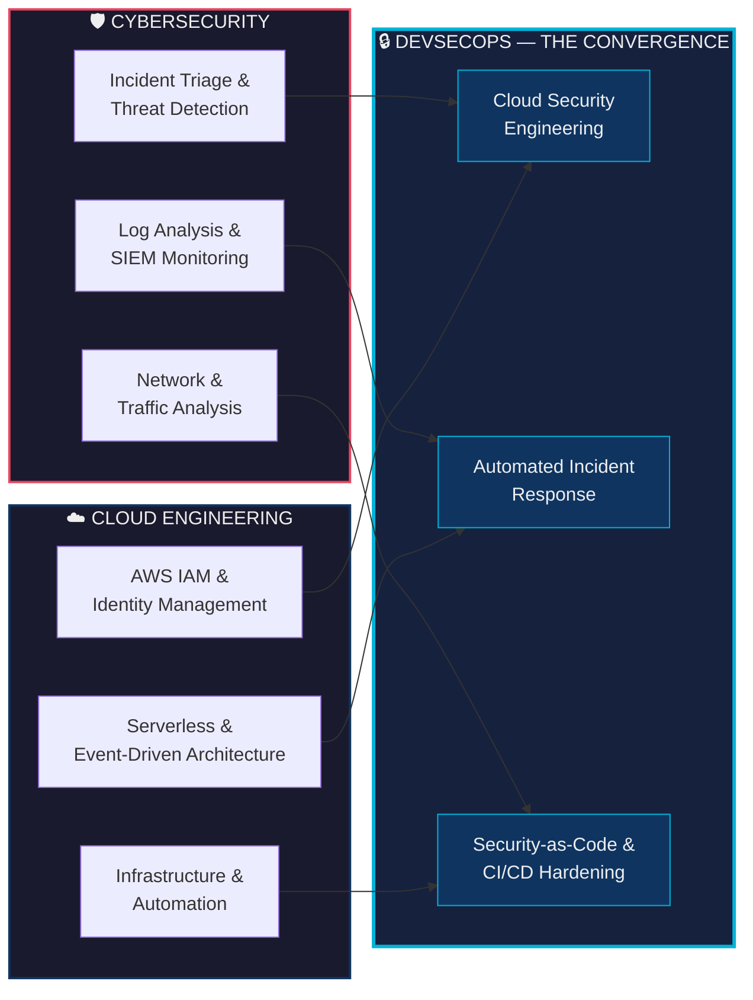

# Rawley Chirume

### SOC Analyst · Cloud Security Engineering · DevSecOps

🎓 B.Sc. Computer Science — Lubelska Akademia WSEI · 📍 Lublin, Poland

---

## 🧭 Professional Summary

Security-focused IT professional with hands-on SOC training and cloud security engineering experience. **Ranked Top 1% on TryHackMe** with practical exposure to log analysis, incident triage, and threat detection workflows. Experienced in monitoring AWS environments, analyzing authentication activity, and implementing **automated containment mechanisms** to mitigate security incidents. Passionate about helping organizations detect, investigate, and respond to security threats in real time.

---

## 🔀 Career Trajectory — Where Cybersecurity Meets Cloud

```mermaid
graph LR
    subgraph CYBER["🛡️ CYBERSECURITY"]
        A1[Incident Triage &\nThreat Detection]
        A2[Log Analysis &\nSIEM Monitoring]
        A3[Network &\nTraffic Analysis]
    end

    subgraph CLOUD["☁️ CLOUD ENGINEERING"]
        B1[AWS IAM &\nIdentity Management]
        B2[Serverless &\nEvent-Driven Architecture]
        B3[Infrastructure &\nAutomation]
    end

    subgraph DEVSECOPS["🔒 DEVSECOPS — THE CONVERGENCE"]
        C1[Cloud Security\nEngineering]
        C2[Automated Incident\nResponse]
        C3[Security-as-Code &\nCI/CD Hardening]
    end

    A1 --> C1
    A2 --> C2
    A3 --> C3
    B1 --> C1
    B2 --> C2
    B3 --> C3

    style CYBER fill:#1a1a2e,stroke:#e94560,stroke-width:2px,color:#eee
    style CLOUD fill:#1a1a2e,stroke:#0f3460,stroke-width:2px,color:#eee
    style DEVSECOPS fill:#16213e,stroke:#00b4d8,stroke-width:3px,color:#eee
    style C1 fill:#0f3460,stroke:#00b4d8,color:#eee
    style C2 fill:#0f3460,stroke:#00b4d8,color:#eee
    style C3 fill:#0f3460,stroke:#00b4d8,color:#eee
```

> *One foot in **Cybersecurity**, the other in **Cloud** — meeting in the middle at **DevSecOps**.*

---

## 🎯 What I Do

| Domain | Focus |
|--------|-------|
| 🔍 **Detect & Respond** | Incident triage, alert escalation, root cause analysis, and real-time threat detection using SIEM platforms |
| 🛡️ **Secure Identities** | AWS IAM policy enforcement, Active Directory administration, least-privilege access, and Kerberos/LDAP analysis |
| ☁️ **Cloud Security Engineering** | Event-driven security pipelines with CloudTrail, Lambda, and SNS for automated containment and alerting |
| 🔗 **Network Analysis** | TCP/IP traffic inspection, DNS investigation, and port-level analysis using Wireshark |
| ⚙️ **Automate & Harden** | Python (Boto3) scripting for security automation, CI/CD pipeline hardening, and infrastructure-as-code |

---

## 🚀 Featured Projects

### **1. [Leaking Star](https://github.com/rawleyc/leaking-star)** &nbsp; `Sep 2026`

**Event-driven AWS pipeline that ingests files from a public S3 bucket, moves them to a private S3 bucket, and logs transfers in DynamoDB.**

- 📥 **Automated Ingestion:** S3 object-created events trigger a Lambda workflow without manual intervention.
- 🔄 **Secure Transfer:** Lambda reads from the public bucket and copies objects to a private bucket.
- 🗂️ **Audit Logging:** Each transfer is recorded in DynamoDB with timestamp, source, destination, and filename metadata.
- 🏗️ **IaC Deployment:** End-to-end resources provisioned and managed with Terraform.

---

### **2. [Słówka V2 — AI-Augmented Polish Vocabulary Engine](https://github.com/rawleyc/modest-bell)** &nbsp; `Aug 2026`

**AI-powered language learning platform with a 5-stage cognitive mastery pipeline and adaptive spaced repetition.**

- 🧠 **5-Stage Mastery Framework:** Guides learners through Learn → Recognize → Recall → Rebuild → Use stages, progressing from flashcard introduction to full sentence composition.
- 📈 **Adaptive Spaced Repetition:** Dynamic mastery scoring (0–100) with tier-based review scheduling (12 hours → 30 days) and automated decay calculations.
- 🤖 **Resilient AI Engine:** Google Gemini API integration for context-aware exercise generation with automatic local fallback and PostgreSQL JSONB caching for sub-millisecond responses.
- ⚡ **Gamification:** Turbo Mode rapid-fire practice, daily XP streaks, overdue review banners, and a comprehensive analytics dashboard.
- 🧪 **Tested:** Vitest suite covering mastery scheduling, game engine state transitions, adaptive session building, and AI provider fallback logic.

---

### **3. [Serverless Task API (Terraform)](https://github.com/rawleyc/stunning-eureka)** &nbsp; `Jul 2026`

**Terraform-based serverless task manager API built to practice cloud architecture fundamentals end to end.**

- 🏗️ **Infrastructure as Code:** Provisioned API Gateway, Lambda, DynamoDB, IAM roles/policies, and CloudWatch logs with Terraform.
- 🔗 **Serverless API Flow:** Designed request routing from API Gateway to Lambda with DynamoDB-backed task operations.
- 📈 **Incremental Delivery:** Structured development in phases from Terraform basics through CRUD, IAM hardening, and refactoring.

---

## 🛠️ Skills & Technologies

<table>
<tr>
<td valign="top" width="33%">

### 🔍 Security Operations
- Incident Triage & Escalation
- Threat Detection & Log Analysis
- Root Cause Analysis
- TCP/IP & DNS Traffic Analysis
- Port Analysis (53, 88)
- Authentication Protocols (Kerberos, LDAP)

</td>
<td valign="top" width="34%">

### ☁️ Cloud Security
- AWS (EC2, IAM, VPC, Lambda)
- CloudTrail Audit Logging
- IAM Policy Enforcement
- Identity Federation Concepts
- S3 & DynamoDB
- VPC, Route53, API Gateway

</td>
<td valign="top" width="33%">

### 🧰 Platforms & Tooling
- **SIEM:** Splunk · IBM QRadar
- **Network:** Wireshark
- **Monitoring:** AWS CloudTrail · GuardDuty
- **Identity:** Active Directory · Group Policy
- **Scripting:** Python (Boto3) · Bash · PowerShell
- **DevOps:** Git · GitHub · Jenkins

</td>
</tr>
</table>

---

## 💼 Experience

### **Mine Vaganti NGO** — *Project Management & IT Support*
**Jul 2025 – Sep 2025**

- 🔐 Administered **Active Directory** environments including Organizational Units and Group Policy Objects.
- ☁️ Supported **Microsoft 365** infrastructure and user authentication issues.
- 🎫 Resolved service desk incidents via ticketing systems while maintaining **SLA targets**.
- 📄 Documented troubleshooting procedures to improve response consistency.

### **InPost S.A.** — *Logistics Operations Coordinator*
**Nov 2024 – Jun 2025**

- 🌐 Diagnosed workstation and **TCP/IP connectivity** issues in a high-volume operational environment.
- 🔍 Investigated recurring system incidents affecting warehouse management systems.
- 🚨 Acted as **first-response technical contact** for operational IT disruptions.

---

## 📚 Training & Continuous Learning

### **TryHackMe** — [Top 1% Global Rank](https://tryhackme.com/p/DartMouthWrld)

**Completed Learning Paths:**
- ✅ Pre-Security
- ✅ Cyber Security 101
- ✅ SOC Level 1

**Focus Areas:**
- Cloud Security (AWS Identity, S3 Security)
- Defensive Security (SIEM, Log Analysis, Incident Response)
- Network Security (Nmap, Wireshark, Protocol Analysis)

---

## 🎓 Education & Certifications

| | Credential | Status |
|---|---|---|
| 🔴 | **CompTIA Security+ Certified** | ✅ Active |
| 🟢 | **ISC² Certified in Cybersecurity (CC)** | ✅ Active |
| 🟠 | **AWS Certified Solutions Architect – Associate (SAA)** | ✅ Active |
| 🟣 | **TryHackMe Security Analyst (SAL1)** | ✅ Certified |
| 🎓 | **B.Sc. Computer Science** — Lubelska Akademia WSEI | 📖 2024 – Present |

---

<strong>📖 More About Me</strong>

 

I'm a Security-focused IT professional who bridges the gap between **Cybersecurity Operations** and **Cloud Engineering**. My trajectory is intentional: building deep expertise in threat detection and incident response while architecting automated security solutions in the cloud — converging at **DevSecOps**.

**What drives me:**
- Building automated detection and response pipelines that reduce MTTR
- Translating security operations knowledge into cloud-native solutions
- Continuous research and hands-on lab work to stay ahead of emerging threats

**Languages:**
- 🇬🇧 English (Native)
- 🇿🇼 Shona (Native)

<strong>💡 Soft Skills & Strengths</strong>

 

- Analytical Thinking & Pattern Recognition
- Structured Incident Escalation
- Attention to Detail in Log Review
- Calm Decision-Making Under Pressure
- Risk Awareness & Security Mindset
- Documentation for Audit & Compliance
- Continuous Threat Research (Self-Learning Driven)

---

### 📬 Let's Connect

Open to roles in **SOC Analysis**, **Cloud Security Engineering**, and **Cyber Security**.

---

*"Security is not a product, but a process." — Bruce Schneier*

